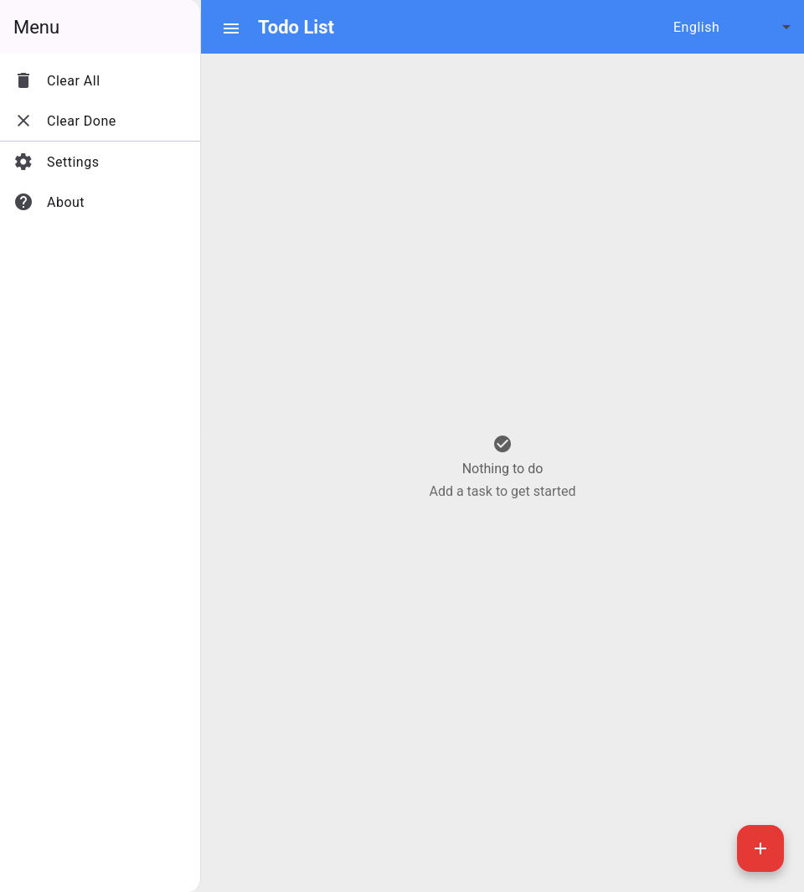
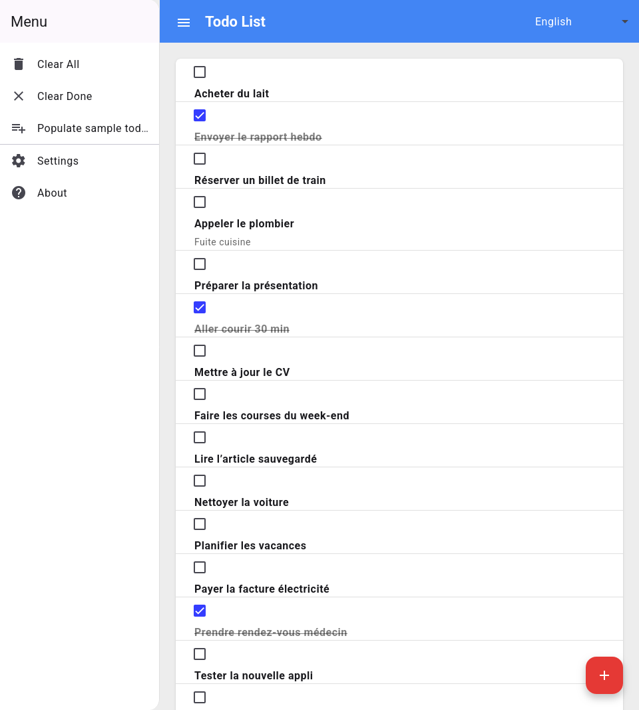

# Todo list – POC Angular 21

Ce dépôt est un proof-of-concept Angular 21 fonctionnel réalisé à partir du projet GWT/Polymer d’origine : https://github.com/manolo/gwt-polymer-todo-list.  
Objectif : reprendre le même scope (todo list simple) et valider une implémentation moderne Angular + Angular Material.

## Fonctionnalités
- Ajout, bascule et suppression des tâches (tout supprimer, supprimer les terminées).
- Persistance locale via `localStorage` pour ne pas perdre les tâches au rechargement.
- Dialogs Material pour confirmation, ajout, paramètres (placeholder) et à-propos (libs & licence).
- Sélecteur de langue (EN/FR/DE) avec traductions regroupées dans `src/app/i18n/translations.ts`.

## Démarrage
```bash
npm install
npm start
```
Ouvrir http://localhost:4200/.

## Construction
```bash
npm run build
```
Le bundle de production est généré dans `dist/`.

## Notes techniques
- Angular 21 + Angular Material.
- Styles et templates des composants dialog sont séparés (`*.html` / `*.scss`).
- Les textes sont typés (`SupportedLang`, `TranslationKey`) et centralisés dans `src/app/i18n/translations.ts`.

## Captures d’écran
- État vide (aucune tâche, invite à en ajouter) :
  
  

- État rempli (liste peuplée, certaines tâches cochées) :
  
  
